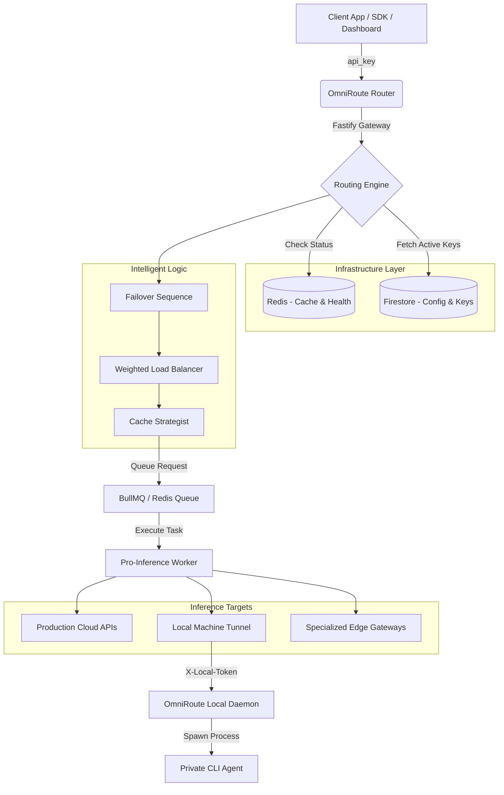

# 🛰️ OmniRouteAI — The Ultimate Multi-Provider AI Router

[](https://fastify.io/)
[](https://redis.io/)
[](https://firebase.google.com/)
[](LICENSE)

**OmniRouteAI** (v2.0) is a high-availability, production-grade AI inference engine and router. It unifies **34+ AI providers** and hundreds of models—from global cloud giants into your private CLI-based agents—into a single, resilient API. 

## 🌟 Why OmniRouteAI?

OmniRouteAI is built for developers who demand **zero downtime**, **cost-efficiency**, and **absolute flexibility**. By abstracting the complexities of 30+ different APIs, it allows you to focus on building features while the router handles failovers, rate limits, and caching.

---

## ⚡ Core Features

*   **🛡️ Enterprise-Grade Failover**: Instantly switches to the next available healthy provider/key if a failure occurs (500s, 429s, or Timeouts).
*   **🔑 Dynamic Key Rotation**: Cycle through an unlimited pool of API keys to bypass provider rate limits and maximize throughput.
*   **💾 Multi-Layer Semantic Caching**: Shared **Redis** caching for identical prompts, reducing latency to <30ms for repeated queries and cutting costs to zero.
*   **🌉 Local CLI Bridge (The Daemon)**: A first-of-its-kind architecture that tunnels cloud-hosted requests to your **local machine** to run CLI-based agents like Claude Code, Gemini CLI, Zai, or Cline—bringing private agents to remote apps.
*   **📊 Unified Observability Dashboard**: A sleek, real-time UI with auditing logs, token economy analytics, and provider health grids.
*   **🌪️ High Performance**: Built on **Fastify** for ultra-low overhead and **BullMQ** for reliable, asynchronous high-concurrency routing.
*   **🧪 No Vendor Lock-in**: Swap between GPT-4o, Claude 3.5, Gemini 2.0, or DeepSeek R1 globally via the dashboard—no code changes required.

---

## 🏛️ Comprehensive Ecosystem

OmniRouteAI supports an exhaustive list of providers, categorized into three strategic layers:

### 1. Global Cloud Agents (API-Direct)
Used for standard high-concurrency production tasks:
- **OpenAI**: GPT-4o, o1, o3-mini, GPT-4.5-pro.
- **Anthropic**: Claude 3 Opus, 3.5 Sonnet, 4.5, 4.6.
- **Google Gemini**: Pro 2.5, Flash 3.0, Flash-lite.
- **DeepSeek**: V3, R1 (DeepSeek-Reasoner), Coder.
- **xAI (Grok)**: Grok-2, Grok-mini, Grok-3 (preview).
- **Alibaba (Qwen)**: Qwen-max, Qwen2.5-coder, Qwen-omni.
- **Moonshot (Kimi)**: Kimi-k2.5, moonshot-v1.
- **Others**: SambaNova, Cerebras (Ultra-fast), Cohere, Groq, NVIDIA (Llama 3.3/Gemma 2), Cloudflare, Inception Labs, Xiaomi (MiMo).

### 2. Hosted Inference Runners
Multi-model aggregators for specialized routing:
- **OpenRouter**: Access to 100+ models via one key.
- **Ollama-Cloud**: High-availability hosted Ollama endpoints.
- **Together AI / Hugging Face**: Open-source model serving (Llama, Mixtral, Qwen).

### 3. Private Local Bridge (CLI-Tunnel)
Run these tools on your local hardware via the **OmniRouteAI-Local Daemon**:
- **High-End Agents**: Antigravity CLI, Claude Code, Gemini CLI, Copilot CLI, Cline, Zai.
- **Code Specialists**: Qwen Code CLI, Kilo AI, OpenCode, Codex, Kiro.
- **Private Engines**: Ollama (Direct Local) and Ollama Bridge (Local).
- **Social/Misc**: Grok CLI (Open Source).

---

## 🖼️ Technical Architecture



---

## 🕹️ Dashboard Breakdown

Manage your entire AI operation from a single, beautiful dashboard:
- **📊 Overview**: Live heartbeat monitoring, provider health indicators, and RPM/Token usage cards.
- **🔌 Provider Management**: Enable/Disable providers, update priority (e.g. "Try Cerebras first, then Groq"), and set default models.
- **🔑 Key Vault**: Securely manage and test keys for all 34+ providers.
- **📝 Audit Logs**: Explore every single request. Inspect raw prompts, JSON responses, exact latencies, and token counts.
- **🎮 Playground**: A sandbox to test models side-by-side. Supports model overrides and "Auto Router" mode.
- **📈 Stats & Analytics**: Detailed token burn reports (Input/Output/Total) and request volume history.

---

## 📁 Project Structure

```text
OmniRouteAI/
├── src/
│   ├── adapters/       # Provider-specific implementations (30+)
│   ├── services/       # Core routing, cache, and db logic
│   ├── config/         # Multi-database & Provider Registry
│   ├── controllers/    # API Request handlers
│   └── worker.js       # Background inference cluster
├── local-daemon/       # The Windows/CLI Tunneling service
│   ├── src/routes/     # Tool-specific endpoints (zai, kimi, etc.)
│   └── dist/           # Pre-compiled .exe for production use
├── frontend/           # The Static React/H5 Dashboard
├── scripts/            # Seed scripts and maintenance tools
└── README.md           # This exhaustive documentation
```

---

## 🚀 Deployment Guide

### 1. Cloud Backend (Railway / Vercel)
OmniRouteAI is optimized for low-latency cloud deployments:
1.  **Repo Setup**: Connect this repository to **Railway**.
2.  **Auth**: Set `GOOGLE_APPLICATION_CREDENTIALS` to your Firestore Service Account JSON.
3.  **Services**:
    - **API Node**: Defaults to `npm start`.
    - **Inference Worker**: Command: `npm run worker`.

### 2. Local Bridge (The Daemon)
To use local agents (Claude/Antigravity) on a cloud backend:
1.  Navigate to `local-daemon/`.
2.  Build: `npm run build:win` or use the pre-compiled `OmniRouteAI-Local.exe`.
3.  **Security**: Copy the daemon's auto-generated token to the backend's `.env` as `LOCAL_DAEMON_TOKEN`.
4.  **Networking**: Connect the backend to your local machine via Cloudflare Tunnel or direct IP.

---

## 📑 Roadmap & Future

OmniRouteAI is evolving rapidly. Upcoming features include:
- [ ] **OpenAuth SSO**: Production-ready user authentication for multi-tenant SaaS.
- [ ] **Semantic Guardrails**: Real-time prompt/response validation and PII masking.
- [ ] **Fine-Tuning Hub**: Direct integration for triggering and managing LoRA/Fine-tuning jobs.
- [ ] **usage-based Billing**: Integration with Stripe for commercial AI routing platforms.

---

## 📜 License & Community

Licensed under the **MIT License**. We aim to build the most flexible AI routing gateway—free from vendor lock-in and corporate proprietary barriers.

---
*Built with ❤️ for the AI Community. Let's Route the Future.*
