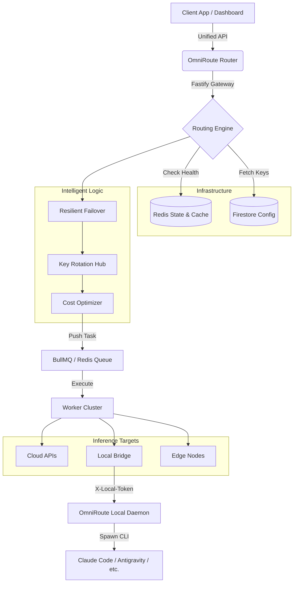

# 🛰️ OmniRouteAI — The Ultimate Multi-Provider AI Router

**OmniRouteAI** is a high-availability, production-grade AI inference engine and router. It unifies **24+ AI providers** and hundreds of models—from cloud giants to local CLI agents—into a single, resilient API.

Built on **Fastify**, **BullMQ**, and **Redis**, it offers automatic failover, smart key rotation, multi-level caching, and a world-class observability dashboard.

---

## ⚡ Core Features

*   **🛡️ Enterprise Failover**: Seamlessly switches to the next available healthy provider/key in milliseconds if a failure occurs.
*   **🔑 Dynamic Key Rotation**: Cycle through an unlimited pool of API keys to bypass rate limits and maximize throughput.
*   **💾 Multi-Layer Caching**: Shared **Redis** caching for identical prompts, reducing latency to <50ms for repeat queries and minimizing costs.
*   **🌉 Local CLI Bridge (v1.1.8)**: A unique architecture that allows cloud-hosted backends to tunnel requests to your **local machine** to run CLI-based agents like Claude Code, Gemini CLI, Zai, or Cline.
*   **📊 Unified Dashboard**: A sleek, real-time UI to manage keys, audit logs, monitor provider health, and analyze token usage.
*   **🌪️ High Performance**: Ultra-low overhead routing designed for extreme concurrency using asynchronous background workers.
*   **🧪 No Vendor Lock-in**: Swap between OpenAI, Claude, or DeepSeek R1 globally by simply flipping a switch—no code changes required.

---

## 🏗️ The Ecosystem

### ☁️ Cloud Providers (API First)
- **Direct Access**: OpenAI, Anthropic, Google Gemini, xAI (Grok), DeepSeek, Alibaba (Qwen), Moonshot (Kimi), Groq, SambaNova, Cerebras, NVIDIA, Cloudflare, Inception Labs, Xiaomi (MiMo), Together AI, Hugging Face, Cohere.
- **Hosted Runners**: OpenRouter, Ollama-Cloud.

### 💻 Local Bridge Tools (The Daemon)
The **OmniRouteAI-Local Daemon** exposes CLI tools via a secure HTTP bridge on your local machine:
- **Agents**: Antigravity, Claude Code, Gemini CLI, Kilo AI, OpenCode, Codex, Kiro, Grok CLI, Zai, Cline, Kimi CLI.
- **Engines**: Ollama (Direct), Ollama Bridge (via Daemon).

---

## 🖼️ Architecture & Flow

---

## 🕹️ Dashboard Overview

Manage your entire AI fleet from a single responsive interface:
- **📋 Overview**: Real-time system health alerts and provider status grids.
- **🔌 Providers**: Fine-grained control over priority, weight, and model selection per-provider.
- **🔑 Key Vault**: Secure management of API keys for 24+ services.
- **📝 Logs**: Deep observability—inspect latency, token usage, and raw request/response objects.
- **🎮 Playground**: A live AI testing ground with model overrides and multi-provider selection.
- **📈 Stats**: Economic insights into your daily token burn and request volume.

---

## 🚀 Deployment Guide

### 1. Cloud Backend (Recommended: Railway)
OmniRouteAI is optimized for **Railway** deployment:
1.  Connect your repository.
2.  Paste your entire **Google Service Account JSON** into `GOOGLE_APPLICATION_CREDENTIALS`.
3.  Deploy two services:
    - **API Node**: Default `npm start`.
    - **Inference Worker**: Command `npm run worker`.

### 2. Local CLI Daemon (The Bridge)
To use local agents (Claude/Antigravity) on a cloud backend:
1.  Navigate to `local-daemon/`.
2.  Run `npm run build:win` or use the pre-compiled `OmniRouteAI-Local.exe`.
3.  Set `LOCAL_DAEMON_TOKEN` in your backend `.env` to match the daemon's auto-generated token.
4.  Point the backend to the daemon via tunnel (e.g., Cloudflare Tunnel / Ngrok) or direct IP.

### 3. Frontend Dashboard
Static files from `/frontend` can be served by any CDN or hosted on **Vercel / Netlify / Cloudflare Pages**. Just set `API_URL` to your backend URL.

---

## 📑 Feature Roadmap

- [ ] **OpenAuth Layer**: Built-in user authentication for shared playground hosting.
- [ ] **Usage Quotas**: Granular API limits per user/key.
- [ ] **Prompt Engineering Hub**: Versioned system prompt templates shared across all providers.
- [ ] **Auto-Discovery**: Automatically find and register local CLI tools on start.
- [ ] **Smart Semantic Cache**: Using vector embeddings to cache similar (not just identical) prompts.

---

## 📜 License & Compliance

OmniRouteAI is open-source software licensed under the **MIT License**. We believe in the power of an open AI ecosystem without gatekeepers.

---
*Developed with ⚡ by the OmniRouteAI Team.*
