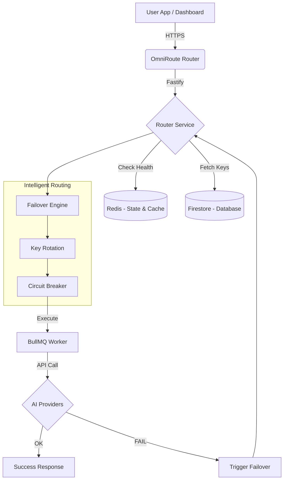

# 🛰️ OmniRouteAI — The Ultimate Multi-Provider AI Router

[](https://fastify.io/)
[](https://redis.io/)
[](https://bullmq.io/)
[](https://firebase.google.com/)
[](https://opensource.org/licenses/MIT)

**OmniRouteAI** is a production-grade AI API router and management system. It allows you to unify 17+ AI providers (including OpenAI, Anthropic, Google, DeepSeek, and more) into a single, highly reliable API with automatic failover, smart load balancing, and enterprise-grade observability.

---

## ⚡ Key Features

*   **🛡️ Resilient Failover**: If a provider or key fails, the router instantly switches to the next available healthy provider in milliseconds.
*   **🔑 Smart Key Rotation**: Cycle through multiple API keys for each provider to maximize throughput and avoid rate limits.
*   **💾 Multi-Level Caching**: Integrated **Redis** caching for identical prompts, reducing costs and latency to near-zero for repeating queries.
*   **🚀 17+ Integrated Providers**: Out-of-the-box support for OpenAI, Anthropic, Google Gemini, xAI (Grok), SambaNova, Cerebras, Cloudflare, DeepSeek, and more.
*   **📊 Full Observability**: A stunning **Real-time Dashboard** to track logs, token usage, error rates, and key health.
*   **🌪️ High Performance**: Built on **Fastify** for ultra-low overhead and **BullMQ** for reliable background job processing.
*   **🧪 No Vendor Lock-in**: Switch from Claude to Llama, or OpenAI to DeepSeek in the dashboard without changing any code in your apps.

---

## 🏗️ Architecture



---

## 📱 Dashboard Overview

The project includes a built-in static dashboard that lets you manage your entire AI fleet:
-   **Overview**: System pulse and provider health.
-   **API Keys**: Add and manage keys for all 17 providers.
-   **Provider Control**: Enable/Disable providers and update priorities.
-   **Detailed Logs**: Audit every single prompt, response, and latency metic.
-   **Stats**: Track your input/output token economy.

---

## 🚀 Quick Start

### 1. Installation
```bash
git clone https://github.com/yourusername/OmniRouteAI.git
cd OmniRouteAI
npm install
```

### 2. Configuration
Create a `.env` file (copied from `.env.example`):
```env
PORT=3000
API_KEY=your-router-api-key
REDIS_URL=rediss://...
GOOGLE_APPLICATION_CREDENTIALS=your-json-here
```

### 3. Run Locally
```bash
# Terminal 1: Start Backend
npm start

# Terminal 2: Start Worker
npm run worker
```

---

## 🌩️ Deployment (FREE)

This project is optimized for deployment on **Railway** (Backend) and **Cloudflare Pages** (Frontend).

### Railway Deployment (Backend)
1.  Connect your repo to [Railway](https://railway.app/).
2.  Set your `.env` variables in the dashboard.
3.  For `GOOGLE_APPLICATION_CREDENTIALS`, paste your **entire service account JSON token**.
4.  Create two services:
    -   **Server**: Uses the default `npm start`.
    -   **Worker**: Set start command to `npm run worker`.

---

## 🛠️ Supported Providers

| Provider | Status | Models |
| :--- | :--- | :--- |
| **OpenAI** | ✅ Ready | All GPT, o1, o3-mini |
| **Anthropic** | ✅ Ready | Claude 3, 3.5, 4.5, 4.6 |
| **Google** | ✅ Ready | Gemini 2.x, 3.x, Gemma 2, 3 |
| **DeepSeek** | ✅ Ready | V3, R1, Chat, Reasoning |
| **SambaNova** | ✅ Ready | Llama 3.3, Qwen, DeepSeek |
| **Cerebras** | ✅ Ready | Llama 3.1 8B/70B (Fast) |
| **...and 10+ more!** | ✅ Ready | Groq, Cisco, Together, NVIDIA, etc. |

---

## 📜 License
This project is licensed under the MIT License — see the [LICENSE](LICENSE) file for details.
